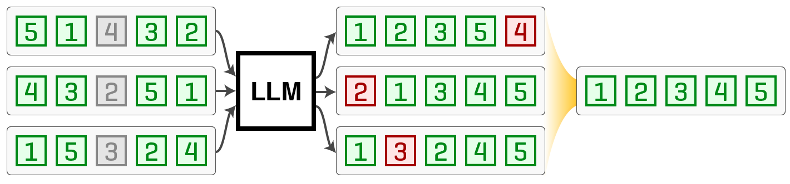

# Permutation Self-Consistency
[](https://huggingface.co/spaces/castorini/perm-sc) [](https://github.com/castorini/perm-sc#citation) [](https://pypi.org/project/permsc) [](https://pepy.tech/project/permsc)



This is the official Python library for permutation self-consistency.
Described in [the paper](https://arxiv.org/abs/2310.07712), our self-consistency-inspired approach improves
listwise ranking in black-box large language models (LLMs) at inference time.
Like the original [self-consistency decoding strategy](https://research.google/pubs/pub52081/), our core algorithm
comprises two main stages:
1. **Sample**: we collect a sample of LLM output rankings by randomly shuffling the input list in the prompt. 
2. **Aggregate**: we combine these rankings into the one that minimizes the Kendall tau distance to all rankings.

Although it has additional utilities for parallel OpenAI calls, the library focuses on the aggregate step. We
implement reciprocal rank fusion, the Kemeny-Young method, Borda aggregation, and local search refinement.

## Getting Started

### Installation
If you need the library only, run
```
pip install permsc
```

If you want to look at the code or the sorting datasets (`./data/`) from the paper, clone the repository:
```
git clone ssh://git@github.com/castorini/perm-sc
```

### Using the Library
The library uses three ways to specify permutations: preference arrays, rank arrays,
and graphs. Preference arrays are the most direct construct for LLMs, with the array 
`[2, 0, 1, 3]` representing the preference of item 2 over item 0 over 1 over 3.
Since the LLM outputs these arrays without any processing, they are the most common
representation in the library's public interface. Rank arrays are an index-based alternative used in some operations, 
such as the Kendall tau calculation. They are defined simply as
`x[i] = rank of element i`, so the preference array `[2, 0, 1, 3]` equates to the rank array
`[1, 2, 0, 3]`. Graphs are more complicated and specific to the Kemeny optimal aggregation
and local search refinement algorithms. Thus, they are abstracted away from the public interface.

Both rank and preference arrays are zero-indexed. The library also denotes missing items
as `-1` in both, though not all algorithms support missing items. See the code-level documentation
for details.

We present a succinct example for aggregating rankings and computing the Kendall tau distance:
```python
import numpy as np
from permsc import KemenyOptimalAggregator, sum_kendall_tau, ranks_from_preferences

preferences = np.array([[1, 2, 0, 3], [1, 2, 3, 0], [1, 2, 0, 3]])
ranks = ranks_from_preferences(preferences)

y_optimal = KemenyOptimalAggregator().aggregate(preferences)
y_optimal_ranks = ranks_from_preferences(y_optimal)
print(y_optimal)  # [1, 2, 0, 3]
print(sum_kendall_tau(ranks, y_optimal_ranks))  # the sum of the Kendall tau distances
```

## Paper Replication

For reproducing the sorting tasks, see `notebooks/sorting-tasks.ipynb`. Our passage ranking
implementation will be checked in shortly. In the meantime, try extending the RankGPT
codebase with this one!

## Citation
```
@article{tang2023found,
  title={Found in the Middle: Permutation Self-Consistency Improves Listwise Ranking in Large Language Models},
  author={Tang, Raphael and Zhang, Xinyu and Ma, Xueguang and Lin, Jimmy and Ture, Ferhan},
  journal={arXiv:2310.07712},
  year={2023}
}
```
